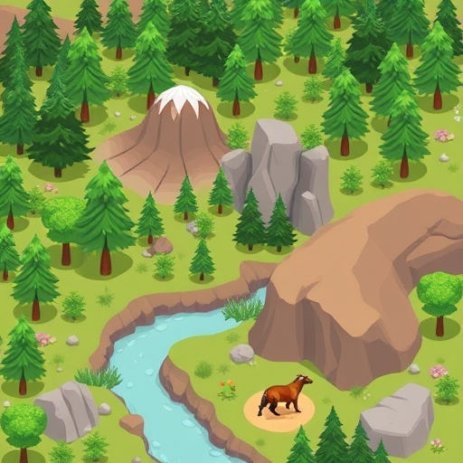

# Build Your Own National Park - Web Game

## Purpose
The purpose of this app is to empower users to build a virtual experience of their wildest dreams. This app, once developed, will allow those who have a profound appreciation for nature to channel their hopes and dreams into a digital world of their own creation. This game fills an industry gap for plant and animal lovers through three distinct ways:

- **Creation of a 3rd Space**: Psychologists have noted the lack of third spaces—communal, undigitized multiplicities—in modern society. This app provides an accessible digital third space.
- **Problem-Solving Skills**: Users will build interactive national parks and navigate challenges such as natural disasters (wildfires, typhoons, etc.) and weather-related obstacles.
- **Life-long Learning**: Users must carefully curate their parks to ensure their success and growth. The game will include gamified awards for features like biodiversity, upkeep, and environmental efforts.

## Target Audience
Hashtags to define target audience:
- #earth, #saveourplanet, #savethereefs, #marsandbeyond, #spacex, #hydroflask, #owalla, #conserve, #nationalparks, #yosemite, #savetheturtles, #volcanoes, #sequoia, #tree, #flower, #grass, #elcap, #capitan, #astrocamp, #camp, #camping, #glamping, #traveltheworld, #expedition, #againstcorporatenvironmentalism, #anticapitalism, #socialism

## Aesthetics
This will be a 3D experience featuring elements of a national park such as animals, plants, changing topography, time, weather, and timeline.

### Natural Landscapes
- **Dynamic Terrain**: Users can customize topography with hills, valleys, rivers, and lakes. Elevation, water flow, and landforms can be manipulated to design unique parks.
- **Seasonal Changes**: The environment will change with the seasons, showcasing vibrant autumn leaves, winter snow, spring blooms, and summer greenery.

### Edwin Comment:
Specify here how the seasons change. Is there a day-night cycle? Can the player change the season at will?

### Edwin Comment:
You might want to add more pictures here showing the landscape in different seasons

### Flora and Fauna
- **Diverse Plant Life**: Include various 3D models of trees, shrubs, flowers, and grasses. Rare species can be offered as achievement rewards.
- **Wildlife Models**: Realistic 3D animals (e.g., bears, deer, birds) that interact with the park environment. Users can attract specific wildlife by planting certain flora.

### Edwin Comment:
Specify if there is a purpose to these animals. How do you get more animals to come to your park? Do they attract more visitors?

**Image Placeholder: Examples of plants and wildlife.**

### Interactive Features
- **Weather Effects**: Real-time weather changes, such as rain, snow, fog, and sunlight. Certain plants may thrive in specific weather conditions.
- **Natural Disasters**: Simulations of wildfires, floods, and storms that users must strategize around to protect their parks.

### Edwin Comment:
How do people prevent these natural disasters? Specify what kind of buildings or other things can be built to serve this purpose. Is there a way to lose the game?

### User-Created Structures
- **Campgrounds and Facilities**: Users can build campsites, picnic areas, educational centers, and observation decks, enhancing the park’s attractiveness.
- **Eco-Friendly Structures**: Options for green buildings (e.g., solar panels, rainwater collection) that blend seamlessly with the natural surroundings.

**Image Placeholder: Examples of user-created structures and eco-friendly designs.**

## Community and Social Spaces
- **Gathering Areas**: Communal spots where avatars can meet, share tips, and celebrate achievements, reinforcing the concept of a third space.
- **Event Spaces**: Designated areas for in-game events, such as festivals celebrating biodiversity or environmental awareness days.

### Edwin Comment:
So is this a multiplayer game? Maybe you should specify that earlier if so. 

## Gamification Elements
- **Achievement Badges**: Earn visually appealing badges or trophies for accomplishments like creating balanced ecosystems or saving endangered species.
- **Interactive Quests**: Tasks that guide users through park exploration and conservation efforts, adding a lifelong learning component.

### Edwin Comment:
Maybe specify more about how the player plays the game. Is there a currency system for buying buildings to create the park or is it like a creative mode sandbox where the player can getinfinite of whatever they want? Should also specify how the player navigates the game. Is it first person, third person, or top down? Is there going to be a main character? If so, is there a story behind them?

## Artistic Style
- **Vibrant Colors**: A bright, inviting color palette to evoke a sense of wonder and positivity.
- **Stylized Graphics**: A semi-realistic art style balancing realism with a playful, whimsical feel.

## Sound and Music
- **Ambient Soundscapes**: 3D audio that includes rustling leaves, flowing water, animal calls, and gentle winds to immerse users.
- **Thematic Music**: Soothing background music that changes with the time of day or weather to enhance the user's emotional connection to their park.

## User Interface (UI)
- **Intuitive Design**: A UI that blends seamlessly with the 3D world, using natural elements like leaves or stones for buttons and menus.
- **Tutorial Elements**: Integrated tutorial prompts to guide users through the building process, making it accessible for all skill levels.

### Edwin Comment:
Overall, just add a lot more images everywhere that are more specific. EX: images showing the UI, the community space, different seasons, natural disasters, the achievements, and more
